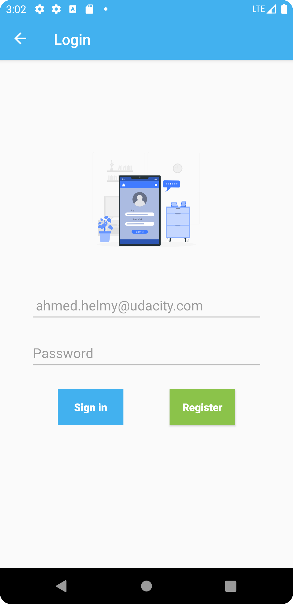
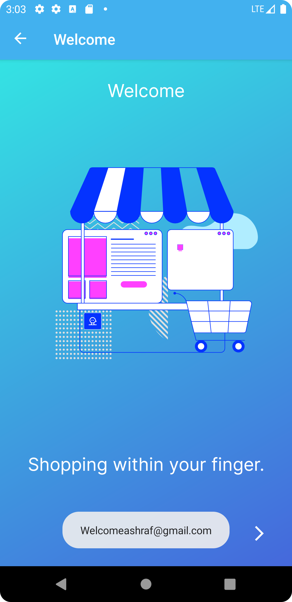
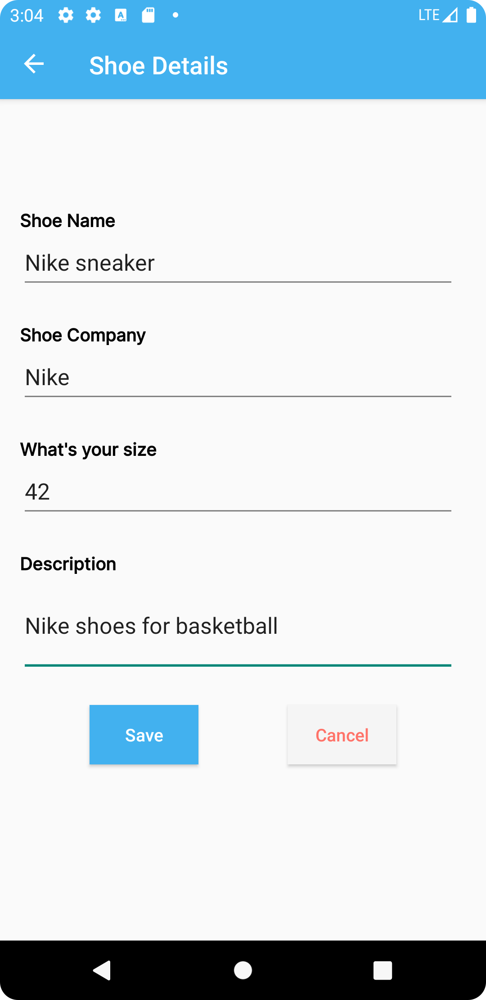

# Shoe Store app

Shoe store android application to add new shoe items, this project is part of Udacity adavanced android developmen with kotlin.

### Dependencies

```
- Lottie
- Coroutine
- ConstraintLayout
- Navigation component
- Gson
- Lifecycle
```

### Installation

To run the app follow these steps

List out the steps

```
1- run android studio.
2- check out develop branch if not checked.
3- click run button.


  
 

